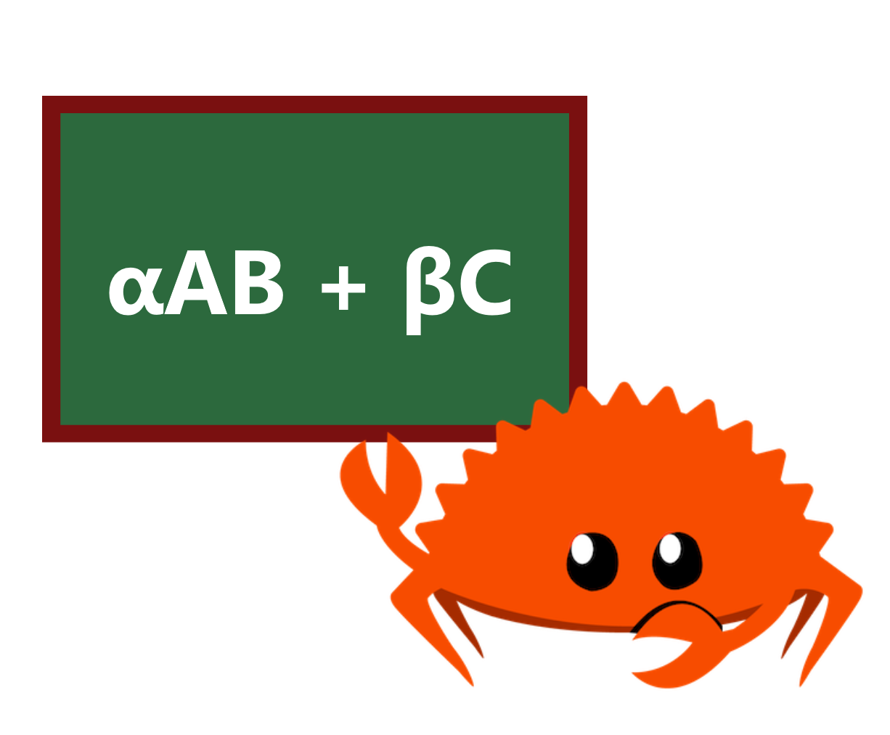

# microgemm
[![github]](https://github.com/cospectrum/microgemm)
[![latest_version]][crates.io]
[![docs.rs]](https://docs.rs/microgemm)

[github]: https://img.shields.io/badge/github-cospectrum/microgemm-8da0cb?logo=github
[latest_version]: https://img.shields.io/crates/v/microgemm.svg?logo=rust
[crates.io]: https://crates.io/crates/microgemm
[docs.rs]: https://img.shields.io/badge/docs.rs-microgemm-66c2a5?logo=docs.rs

General matrix multiplication with custom configuration in Rust. <br>
Supports `no_std` and `no_alloc` environments.

The implementation is based on the BLIS microkernel approach.

## Getting Started

The `Kernel` trait is the main abstraction of `microgemm`.
You can implement it yourself or use kernels that are already provided out of the box.

### gemm

```rust
use microgemm as mg;
use microgemm::Kernel as _;

fn main() {
    let kernel = mg::kernels::Generic8x8Kernel::<f32>::new();
    assert_eq!(kernel.mr(), 8);
    assert_eq!(kernel.nr(), 8);

    let pack_sizes = mg::PackSizes {
        mc: 5 * kernel.mr(), // MC must be divisible by MR
        kc: 190,
        nc: 9 * kernel.nr(), // NC must be divisible by NR
    };
    let mut packing_buf = vec![0.0; pack_sizes.buf_len()];

    let alpha = 2.0;
    let beta = -3.0;
    let (m, k, n) = (100, 380, 250);

    let a = vec![2.0; m * k];
    let b = vec![3.0; k * n];
    let mut c = vec![4.0; m * n];

    let a = mg::MatRef::new(m, k, &a, mg::Layout::RowMajor);
    let b = mg::MatRef::new(k, n, &b, mg::Layout::RowMajor);
    let mut c = mg::MatMut::new(m, n, &mut c, mg::Layout::RowMajor);

    // c <- alpha a b + beta c
    kernel.gemm(alpha, &a, &b, beta, &mut c, &pack_sizes, &mut packing_buf);
    println!("{:?}", c.as_slice());
}
```
Also see [no_alloc](./examples/no_alloc.rs) example for use without `Vec`.

### Implemented Kernels

| Name | Scalar Types | Target |
| ---- | ------------ | ------ |
| GenericNxNKernel <br> (N: 2, 4, 8, 16, 32) | T: Copy + Zero + One + Mul + Add | Any |
| NeonKernel | f32 | aarch64 and target feature neon |
| WasmSimd128Kernel | f32 | wasm32 and target feature simd128 |

### Custom Kernel Implementation

```rust
use microgemm::{typenum::U4, Kernel, MatMut, MatRef};

struct CustomKernel;

impl Kernel for CustomKernel {
    type Scalar = f64;
    type Mr = U4;
    type Nr = U4;

    // dst <- alpha lhs rhs + beta dst
    fn microkernel(
        &self,
        alpha: f64,
        lhs: &MatRef<f64>,
        rhs: &MatRef<f64>,
        beta: f64,
        dst: &mut MatMut<f64>,
    ) {
        // lhs is col-major by default
        assert_eq!(lhs.row_stride(), 1);
        assert_eq!(lhs.nrows(), Self::MR);

        // rhs is row-major by default
        assert_eq!(rhs.col_stride(), 1);
        assert_eq!(rhs.ncols(), Self::NR);

        // dst is col-major by default
        assert_eq!(dst.row_stride(), 1);
        assert_eq!(dst.nrows(), Self::MR);
        assert_eq!(dst.ncols(), Self::NR);

        // your microkernel implementation...
    }
}
```

## Benchmarks

All benchmarks are performed on square matrices of dimension `n`.

### f32
`PackSizes { mc: n, kc: n, nc: n }`

####  aarch64 (M1)
```
   n    NeonKernel    Generic4x4    Generic8x8  naive(rustc)
  32        10.7µs        13.9µs        12.7µs        53.2µs
  64        50.6µs          73µs        62.7µs       307.7µs
 128       257.5µs       482.8µs       379.8µs         2.5ms
 256           1ms           2ms         1.3ms         9.5ms
 512         3.4ms         8.4ms           6ms        94.5ms
1024          25ms        66.4ms        46.4ms       882.7ms
```

## License
Licensed under either of [Apache License, Version 2.0](./LICENSE-APACHE)
or [MIT license](./LICENSE-MIT) at your option.
