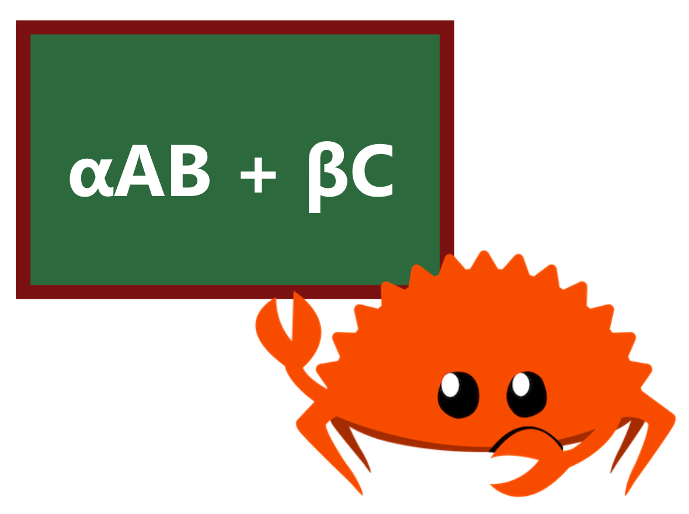

# microgemm
[![github]](https://github.com/cospectrum/microgemm)
[![latest_version]][crates.io]
[![docs.rs]](https://docs.rs/microgemm)
[](https://deps.rs/repo/github/cospectrum/microgemm)

[github]: https://img.shields.io/badge/github-cospectrum/microgemm-8da0cb?logo=github
[latest_version]: https://img.shields.io/crates/v/microgemm.svg?logo=rust
[crates.io]: https://crates.io/crates/microgemm
[docs.rs]: https://img.shields.io/badge/docs.rs-microgemm-66c2a5?logo=docs.rs

General matrix multiplication with custom configuration in Rust. <br>
Supports `no_std` and `no_alloc` environments.

The implementation is based on the [BLIS](https://github.com/flame/blis) microkernel approach.

## Content
- [Install](#install)
- [Usage](#usage)
    - [gemm](#gemm)
    - [Implemented Kernels](#implemented-kernels)
    - [Custom Kernel Implementation](#custom-kernel-implementation)
- [Benchmarks](#benchmarks)
    - [f32](#f32)
- [License](#license)

## Install
```sh
cargo add microgemm
```

## Usage

The `Kernel` trait is the main abstraction of `microgemm`.
You can implement it yourself or use kernels that are already provided out of the box.

### gemm

```rust
use microgemm::{kernels::GenericKernel8x8, Kernel as _, MatMut, MatRef, PackSizes};

fn main() {
    let kernel = GenericKernel8x8::<f32>::new();
    let [m, k, n] = [100, 380, 250];

    let [mc, kc, nc] = [m, k / 2, n];
    let pack_sizes = PackSizes { mc, kc, nc };
    let mut packing_buf = vec![0.0; pack_sizes.buf_len()];

    let (alpha, beta) = (2.0, -3.0);

    let a = vec![2.0; m * k];
    let b = vec![3.0; k * n];
    let mut c = vec![4.0; m * n];

    let a = MatRef::row_major(m, k, &a);
    let b = MatRef::row_major(k, n, &b);
    let mut c = MatMut::row_major(m, n, &mut c);

    // c <- alpha a b + beta c
    kernel.gemm(alpha, a, b, beta, &mut c, pack_sizes, &mut packing_buf);
    println!("{:?}", c.as_slice());
}
```
Also see [no_alloc](./examples/no_alloc.rs) example for use without `Vec`.

### Implemented Kernels

| Name | Scalar Types | Target |
| ---- | ------------ | ------ |
| GenericKernelNxN <br> (N: 2, 4, 8, 16, 32) | T: Copy + Zero + One + Mul + Add | Any |
| NeonKernel4x4 | f32 | aarch64 and target feature neon |
| NeonKernel8x8 | f32 | aarch64 and target feature neon |

### Custom Kernel Implementation

```rust
use microgemm::{typenum::U4, Kernel, MatMut, MatRef};

struct CustomKernel;

impl Kernel for CustomKernel {
    type Scalar = f64;
    type Mr = U4;
    type Nr = U4;

    // dst <- alpha lhs rhs + beta dst
    fn microkernel(
        &self,
        alpha: f64,
        lhs: MatRef<f64>,
        rhs: MatRef<f64>,
        beta: f64,
        dst: &mut MatMut<f64>,
    ) {
        // lhs is col-major
        assert_eq!(lhs.row_stride(), 1);
        assert_eq!(lhs.nrows(), Self::MR);

        // rhs is row-major
        assert_eq!(rhs.col_stride(), 1);
        assert_eq!(rhs.ncols(), Self::NR);

        // dst is col-major
        assert_eq!(dst.row_stride(), 1);
        assert_eq!(dst.nrows(), Self::MR);
        assert_eq!(dst.ncols(), Self::NR);

        // your microkernel implementation...
    }
}
```

## Benchmarks

All benchmarks are performed in a `single thread` on square matrices of dimension `n`.

### f32
`PackSizes { mc: n, kc: n, nc: n }`

####  aarch64 (M1)
```
   n  NeonKernel8x8           faer matrixmultiply
 128         64.6µs        256.3µs         49.5µs
 256        419.5µs          3.2ms        518.2µs
 512          2.9ms         16.3ms          2.8ms
1024           23ms        132.7ms         22.5ms
2048        185.5ms             1s        182.8ms
```

## License
Licensed under either of [Apache License, Version 2.0](./LICENSE-APACHE)
or [MIT license](./LICENSE-MIT) at your option.
